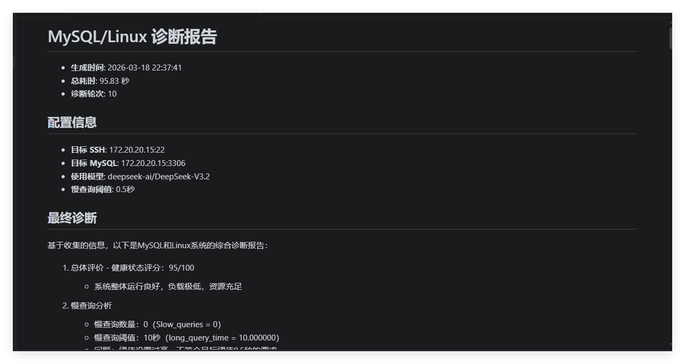

# MySQLDiag

一个自主的 MySQL 和 Linux 系统性能诊断工具，使用 LLM 自动决策需要收集哪些信息，最终生成综合诊断报告。



## 功能特性

- **自主诊断**: LLM 自动决定下一步查询什么
- **中文界面**: 全中文提示词和报告
- **只读安全**: 严格的白名单机制，只允许只读操作
- **双端检查**: 同时检查 MySQL 数据库和 Linux 系统
- **多查询支持**: 支持一次执行多条 SQL 语句
- **详细报告**: 生成完整的 Markdown 格式诊断报告

## 项目结构

```
MySQLDiag/
├── main.py                      # 主入口点
├── pyproject.toml               # 项目配置
├── .env                         # 环境变量配置
├── CLAUDE.md                    # 项目开发指南
├── src/
│   └── mysql_diagnostic_agent/
│       ├── __init__.py          # 包初始化
│       ├── config.py            # 配置管理模块
│       ├── core/                # 核心模块
│       │   ├── __init__.py
│       │   └── tool_call.py    # 工具调用数据类
│       ├── tools/               # 工具类
│       │   ├── __init__.py
│       │   ├── ssh_tool.py      # SSH 命令执行模块
│       │   └── mysql_tool.py    # MySQL 查询模块
│       ├── agent/               # Agent 模块
│       │   ├── __init__.py
│       │   └── diagnostic_agent.py  # Agent 核心逻辑
│       └── report/              # 报告模块
│           ├── __init__.py
│           └── report_writer.py     # 报告生成模块
├── reports/                     # 报告输出目录
└── docs/                        # 文档目录
    └── superpowers/
        └── plans/               # 重构计划文档
```

## 安装依赖

使用 uv 创建虚拟环境并安装依赖：

```bash
uv sync
```

或手动安装：

```bash
pip install paramiko pymysql python-dotenv httpx
```

## 配置

编辑 `.env` 文件配置连接信息：

```env
# SiliconFlow API
SILICONFLOW_API_KEY=your_api_key
SILICONFLOW_BASE_URL=https://api.siliconflow.cn/v1/
SILICONFLOW_MODEL=deepseek-ai/DeepSeek-V3.2

# SSH Configuration
SSH_HOST=172.20.20.15
SSH_PORT=22
SSH_USER=root
SSH_PASSWORD=your_password

# MySQL Configuration
MYSQL_HOST=172.20.20.15
MYSQL_PORT=3306
MYSQL_USER=root
MYSQL_PASSWORD=your_password
MYSQL_DATABASE=ownit

# Diagnostic Configuration
SLOW_QUERY_THRESHOLD=0.5
```

## 运行

```bash
uv run python main.py
```

或直接：

```bash
python main.py
```

## 安全特性

### MySQL 只读保护

- 只允许: `SELECT`, `SHOW`, `DESCRIBE`, `EXPLAIN`, `USE`
- 阻止: `INSERT`, `UPDATE`, `DELETE`, `DROP`, `ALTER`, `CREATE` 等
- 支持一次执行多条用分号分隔的查询

### SSH 命令白名单

- 允许系统监控命令: `top`, `free`, `df`, `ps`, `netstat`, `vmstat` 等
- 禁止任何写入操作或危险命令
- 阻止管道、重定向、命令链等

## 诊断流程示例

1. 检查慢查询数量: `SHOW GLOBAL STATUS LIKE 'Slow_queries'`
2. 查询 QPS 统计: `SHOW GLOBAL STATUS LIKE 'Questions'`
3. 查看线程状态: `SHOW FULL PROCESSLIST`
4. 检查锁信息: `SHOW ENGINE INNODB STATUS`
5. 查看系统内存: `free -h`
6. 检查 CPU 使用: `top -bn1 | head -20`
7. ... (LLM 自动决定后续步骤)
8. 输出最终诊断报告

## 输出

- 控制台显示诊断摘要
- `reports/` 目录下生成完整的 Markdown 报告
- 报告包含每一轮的查询和观察结果

## 版本历史

### v1.0.0

- 项目重命名为 **MySQLDiag**
- 代码重构优化，采用模块化目录结构
- 新增统一的配置管理模块 `config.py`
- 分离 `ToolCall` 类到独立模块
- 简化代码注释，提升可读性
- 修复 LIKE 查询包含 `%` 字符的 bug

### v0.2.0

- 代码重构: 所有模块移至 `src/mysql_diagnostic_agent/` 包目录
- 中文注释: 所有代码添加了详细的中文注释
- 中文 Prompt: System prompt 改为中文，诊断更符合中文习惯
- 多查询支持: MySQL 工具支持一次执行多条用分号分隔的 SQL
- 增强诊断: 系统提示词包含更全面的诊断建议和检查项
